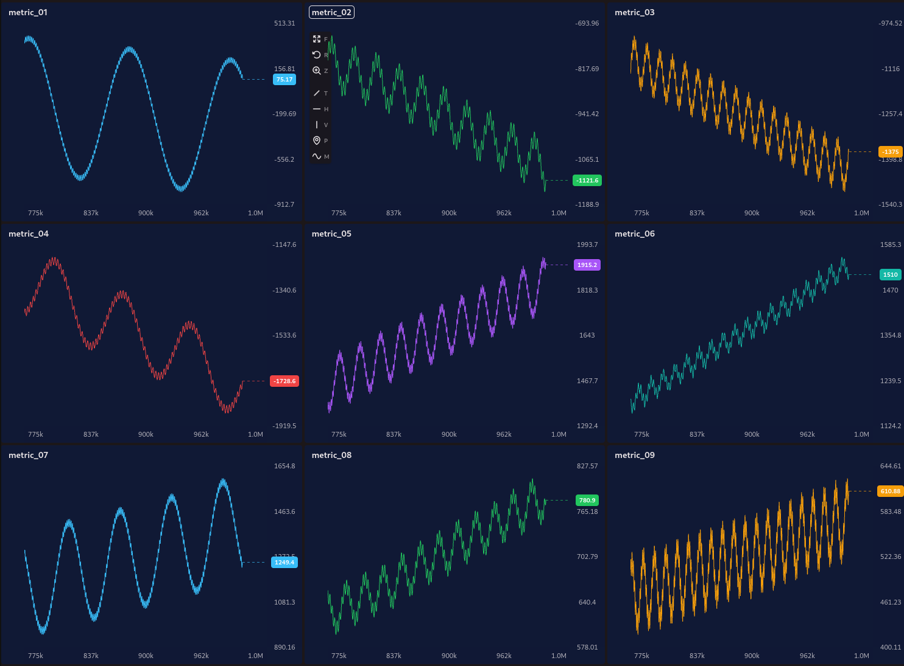
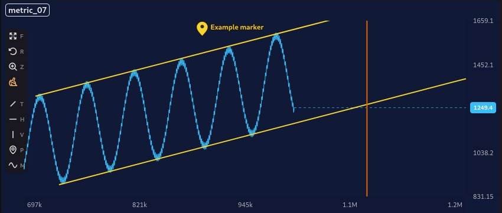

<h1 align="center">
  <br>
  
</h1>

GPU-rendered chart grid for multi-metric dashboards — such as monitoring AI training runs, where you need many live-updating charts with millions of points each.

By rendering every series with WebGL, AlienCharts keeps dense chart grids smooth where SVG/Canvas libraries stall.

> **Note:** AlienCharts currently supports **line charts** only. Other chart types may be added in the future.





## Features

- **High performance** — render many metrics in a grid with millions of points each, all drawn through a single shared WebGL context.
- **Live data** — append points to a series and the chart follows the latest values.
- **Level of Detail (LOD)** — each zoom level draws only the points it needs.
- **Chart interactions** — crosshair, zoom, pan, fullscreen mode, drawings, and moving averages. All have their own hotkeys.

## Installation

```bash
npm install aliencharts
```

`react` and `react-dom` (v18+) are peer dependencies, so make sure they are installed in your app.

AlienCharts ships its own self-contained stylesheet, import it once in your app:

```js
import "aliencharts/styles.css";
```

Dark mode follows a `.dark` class on any ancestor element (e.g. `<html class="dark">`).

## Quick start

Build an array of `charts`, where each chart has an `id`, a `title`, and one or more `series` created with `createSeries`. Pass them to `<ChartGrid>`:

```jsx
import "aliencharts/styles.css";
import { ChartGrid, createSeries } from "aliencharts";

const charts = [
  {
    id: "loss",
    title: "train/loss",
    series: [
      createSeries({
        id: "run-1",
        name: "Run 1",
        color: "#38bdf8",
        x: [0, 1, 2, 3, 4],
        y: [2.5, 1.9, 1.4, 1.1, 0.9],
      }),
    ],
  },
];

export default function Dashboard() {
  return <ChartGrid charts={charts} columns={2} />;
}
```

For a fuller example, including live appending and theming — see [`examples/DemoPage.jsx`](./examples/DemoPage.jsx).

### Drawings

Drawings are controlled by your app. Keep the drawing array and active tool in state, then pass that state into `ChartGrid`:

```jsx
import { useCallback, useState } from "react";
import { ChartGrid } from "aliencharts";

export default function Dashboard({ charts }) {
  const [drawings, setDrawings] = useState([]);
  const [activeDrawingTool, setActiveDrawingTool] = useState(null);
  const [selectedDrawingId, setSelectedDrawingId] = useState(null);

  const createDrawingId = useCallback(
    ({ chartId, type }) => `${chartId}:${type}:${crypto.randomUUID()}`,
    [],
  );

  return (
    <ChartGrid
      charts={charts}
      drawings={drawings}
      onDrawingsChange={setDrawings}
      activeDrawingTool={activeDrawingTool}
      onActiveDrawingToolChange={setActiveDrawingTool}
      selectedDrawingId={selectedDrawingId}
      onSelectedDrawingIdChange={setSelectedDrawingId}
      createDrawingId={createDrawingId}
    />
  );
}
```

Supported drawing tools are `"trendline"`, `"hline"`, `"vline"`, and `"pin"`. Since drawings live outside the component, you can persist them however you want, such as local storage, a database, or app state.

Set `disableDrawings` when you want a read-only chart toolbar without drawing or moving-average tools.

## API

### `createSeries(options)`

Creates a line series.

| Option | Type | Description |
| --- | --- | --- |
| `id` | `string` | Unique series id. |
| `name` | `string` | Display name (defaults to `id`). |
| `color` | `string` | CSS color of the line (defaults to `#38bdf8`). |
| `x` | `number[] \| Float64Array` | X values (e.g. step / time). |
| `y` | `number[] \| Float32Array` | Y values. |

The returned series has an `append(xValues, yValues)` method for streaming in new points.

### `createMockCharts(options?)`

Generates an array of charts with synthetic data for demos and benchmarking. Options: `chartCount`, `seriesPerChart`, `pointCount`.

### `<ChartGrid>`

Renders a responsive grid of charts. Commonly used props:

| Prop | Type | Default | Description |
| --- | --- | --- | --- |
| `charts` | `Chart[]` | — | Charts to render. Each is `{ id, title, series }`. |
| `columns` | `number` | `2` | Number of columns in the grid. |
| `dataRevision` | `number` | `0` | Bump this after appending points to trigger a re-render. |
| `followLatest` | `boolean` | `false` | Keep the view pinned to the newest data. |
| `xAxisLabel` | `string` | `"STEP"` | Label shown on the x-axis. |
| `backgroundColor` | `string` | — | Chart background color. |
| `antialiasLines` | `boolean` | `false` | Enable line antialiasing. |
| `drawings` | `Drawing[]` | `[]` | Controlled drawing objects. |
| `onDrawingsChange` | `(drawings) => void` | — | Called when drawings are created, edited, deleted, or styled. |
| `activeDrawingTool` | `"trendline" \| "hline" \| "vline" \| "pin" \| null` | `null` | Controlled active drawing tool. |
| `onActiveDrawingToolChange` | `(tool) => void` | — | Called when the toolbar or hotkeys change the active drawing tool. |
| `selectedDrawingId` | `string \| null` | `null` | Controlled selected drawing id. |
| `onSelectedDrawingIdChange` | `(id) => void` | — | Called when a drawing is selected or deselected. |
| `createDrawingId` | `({ chartId, type }) => string` | — | Optional id factory for new drawings. |
| `disableDrawings` | `boolean` | `false` | Hide and disable drawing and moving-average tools. |
| `onChartContextMenu` | `({ chart, event, point }) => void` | — | Called on chart right-click. Use it to render your own context menu. |

## License

[MIT](./LICENSE) © FarangLab
